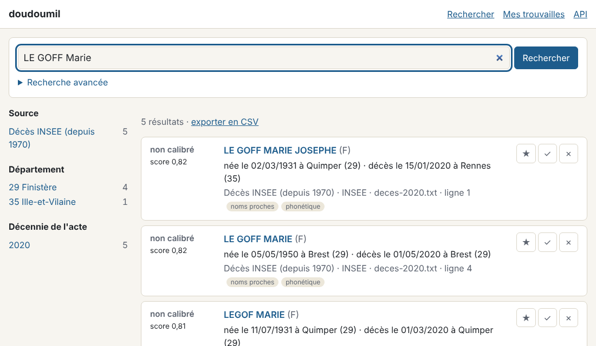
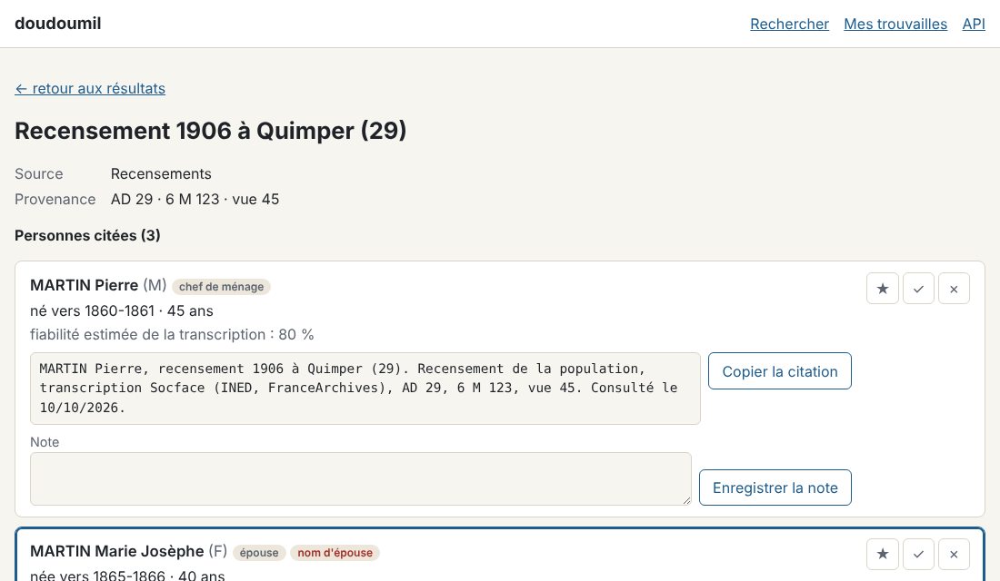

# doudoumil-search

Moteur de recherche généalogique personnel, fonctionnant entièrement en local. Il indexe des
notices nominatives issues d'archives françaises et les interroge avec tolérance aux variantes
orthographiques. En option, il les rapproche des individus d'un arbre GEDCOM.

La recherche approchée est le cas nominal : les sources transcrites automatiquement (par
exemple les recensements Socface) ont un taux d'erreur de 15 à 20 %. Chaque résultat porte un
niveau de confiance, et chaque notice garde sa provenance (cote, vue, URL).

Objectif : remplacer Filae pour un usage personnel (recherche nominative, recensements
transcrits, images des actes). La feuille de route est dans [`PLAN.md`](PLAN.md).

## Prérequis

- [uv](https://docs.astral.sh/uv/) ≥ 0.4
- Python 3.11 (uv l'installe si besoin : `uv python install 3.11`)

## Installation

```bash
uv sync
```

## Vérifications

```bash
uv run ruff check
uv run ruff format --check
uv run pytest
```

## Modèle pivot

Toutes les sources sont ramenées à deux tables, définies dans
`src/doudoumil_search/pivot.py` (validation Pydantic) et `src/doudoumil_search/schemas.py`
(schémas Parquet) :

- `actes` : le document d'archive et sa provenance (`source`, `depot`, `cote`, `vue`,
  `url_image`) ;
- `mentions` : les personnes citées dans l'acte avec leur rôle (sujet, père, mère, témoin…).

Les identifiants `acte_id` et `mention_id` sont des empreintes déterministes de la source et
de la ligne d'origine. Réingérer un fichier redonne donc les mêmes identifiants.

## Couches de données

Tout est écrit sous `data/`, qui n'est pas versionné :

| couche | contenu |
|---|---|
| `data/bronze/` | fichiers sources tels que téléchargés, et leur conversion au format pivot sans normalisation |
| `data/silver/` | Parquet pivot avec les champs normalisés (`nom_norm`, `nom_phonetique`…) |
| `data/gold/` | base DuckDB indexée pour la recherche |
| `data/releves/` | tes relevés (tableurs et fichiers de correspondance) : à sauvegarder |
| `data/perso/` | tes trouvailles (favoris, notes, verdicts) : à sauvegarder |
| `data/sauvegardes/` | archives de `doudoumil sauvegarde` (à copier hors de l'ordinateur) |

Une couche ne modifie jamais la précédente : chaque étape produit de nouveaux fichiers.

## Démonstration

### Jalon 2 — ingestion INSEE décès

```bash
uv run doudoumil telecharge insee --annees 2019-2020   # fichiers dans data/bronze/insee_deces/telechargements/
uv run doudoumil ingest insee --processus 4            # Parquet pivot dans data/bronze/insee_deces/<fichier>/

# sans téléchargement, sur le fichier d'exemple (personnes inventées) :
uv run doudoumil ingest insee tests/fixtures/deces-extrait.txt
uv run python -c "import polars as pl; print(pl.read_parquet('data/bronze/insee_deces/deces-extrait/mentions-*.parquet'))"
```

Chaque partition contient aussi `rejets.csv`, la liste des lignes écartées et leur motif.

### Jalon 3 — normalisation (couche silver)

```bash
uv run doudoumil telecharge communes   # référentiel des communes dans data/ref/communes/
uv run doudoumil normalize             # Parquet normalisé et dédoublonné dans data/silver/<source>/
```

| brut | `nom_norm` | `nom_phonetique` |
|---|---|---|
| `Le Goff`, `LE-GOFF` | `LE GOFF` | `LKF` |
| `LEGOF`, `Le Goffe` | `LEGOF`, `LE GOFFE` | `LKF` |
| `d'Hervé` | `D HERVE` | `DRV` |

Prénoms : `Jn-Bte Marie` → `JEAN BAPTISTE MARIE`, `Joannes` → `JEAN`. Naissance : une date
incomplète `19310300` donne l'intervalle `[1931, 1931]`, un âge de 40 ans dans un recensement
de 1906 donne `[1865, 1866]`.

### Jalon 4 — base de recherche et recherche approchée

```bash
uv run doudoumil index                 # base DuckDB dans data/gold/recherche.duckdb
uv run doudoumil cherche "LEGOF Marie" --naissance 1931 --lieu Quimper --details
```

```
  1. non calibré (score 0,99) — LE GOFF MARIE JOSEPHE (F), née le 02/03/1931 à QUIMPER, décès le 15/01/2020 à Rennes (35)
     INSEE · deces-extrait.txt · vue 1   [noms proches, phonétique, sans le nom]
     nom 0,97, prénoms 1,00, naissance 1,00, lieu 1,00
```

Sans le nom, avec un prénom, une année approximative et un département :

```bash
uv run doudoumil cherche --prenoms Yves --naissance 1920 --lieu 29
```

Options : `--sexe`, `--annees` (année de l'acte), `--conjoint` (nom du mari, pour une femme
inscrite sous son nom d'épouse), `--source`, `--limite`. Le lieu accepte un département
(`29`), un code INSEE (`29232`) ou un nom de commune (`Saint-Denis (974)` pour lever une
homonymie).

Qualité et calibration :

```bash
uv run doudoumil evalue                 # requêtes imprécises sur la base telle quelle
uv run doudoumil evalue --mode donnees  # requêtes exactes sur une copie bruitée des données
uv run doudoumil calibre                # le score devient une probabilité (« très probable »…)
```

### Jalon 5 — interface web locale

```bash
uv run doudoumil serve        # ouvre http://127.0.0.1:8765 dans le navigateur
```



- **Recherche** simple (« NOM Prénoms ») ou avancée (sexe, naissance, lieu avec
  autocomplétion, années de l'acte, nom du conjoint, source) ; l'adresse de la page résume la
  recherche et peut être gardée en marque-page.
- **Résultats** classés, avec filtres par source, département et décennie, et export CSV.
- **Fiche** de l'acte avec toutes les personnes citées (le foyer entier pour un recensement),
  la provenance et une citation prête à copier.
- **Mes trouvailles** : ★ favori, note, verdict ✓ / ✗. Elles sont gardées dans
  `data/perso/trouvailles.sqlite` (à sauvegarder) ; les verdicts servent à
  `doudoumil calibre`.
- **API JSON** documentée sur `/api/docs`.



L'interface n'écoute que sur la machine (`127.0.0.1`) et refuse les envois venus d'un autre
site.

### Jalon 8 — relevés en CSV ou Excel

N'importe quel tableur de relevés (cercle généalogique, dépouillements personnels) s'importe
grâce à un petit fichier qui décrit ses colonnes ; mode d'emploi dans
[`docs/releves.md`](docs/releves.md).

```bash
cp bms-landerneau.csv data/releves/
uv run doudoumil ingest releve --modele data/releves/bms-landerneau.csv  # prépare le .toml
uv run doudoumil ingest releve      # après relecture du .toml
uv run doudoumil normalize releve && uv run doudoumil index
uv run doudoumil cherche "LE GOF Marie" --naissance 1755 --limite 2
```

Avec le relevé d'essai `tests/fixtures/releves/` (données inventées) :

```
landerneau-bms.csv : 7 ingérées, 3 rejetées (date de l'acte incomplète : 1, sexe inconnu : 1,
  clé en double (numéro d'ordre ajouté) : 1, âge illisible : 1)
  lignes rejetées et motifs : data/bronze/releve/landerneau-bms/rejets.csv
  1. non calibré (score 0,89) — LE GOFF Marie Josèphe (F), née en 1755, baptême le 02/03/1755 à Landerneau (29)
     AD 29 · 3 E 103/2 · vue 12   [noms proches, phonétique]
  2. non calibré (score 0,68) — LE GOFF Jean (M), né en 1756, baptême le 15/07/1756 à Landerneau (29)
     AD 29 · 3 E 103/2 · vue 27   [noms proches, phonétique]
```

La commune « Landerneau » est rattachée à son code INSEE à la normalisation, et l'année de
naissance d'un baptisé est déduite de la date du baptême. La fiche et la citation reprennent le
titre du relevé ; les verdicts sur ces notices calibrent la source « Relevés ».

### Jalon 10 — commande unique et sauvegarde

```bash
uv run doudoumil pipeline --telecharge  # télécharge, convertit, normalise, indexe
uv run doudoumil pipeline               # ensuite : ne refait que ce qui a changé
uv run doudoumil sauvegarde --vers /media/cle-usb
uv run doudoumil restaure /media/cle-usb/doudoumil-20261010-173944.zip
```

Second passage, rien n'a changé :

```
décès INSEE : 1 fichier déjà converti
relevé landerneau-bms : à jour
normalisation insee_deces : à jour
normalisation releve : à jour
base de recherche : à jour
```

Un nouveau mois de décès INSEE ou un relevé complété n'entraîne que la conversion de ce fichier,
puis la mise à jour de la normalisation et de la base. La sauvegarde (archive zip) contient
tout ce qui ne se reconstruit pas : tes trouvailles (`data/perso/`) et tes relevés
(`data/releves/`) ; elle se télécharge aussi depuis la page « Mes trouvailles ». La
restauration sauvegarde d'abord l'état actuel.

## Arborescence

```
src/doudoumil_search/
├── pivot.py        # modèle pivot (Acte, Mention) et fabriquer_id()
├── schemas.py      # schémas Parquet
├── cli.py          # commande doudoumil
├── pipeline.py     # doudoumil pipeline : ne refait que ce qui a changé
├── sauvegarde.py   # sauvegarde et restauration des trouvailles et des relevés
├── ingest/         # connecteurs (INSEE décès, relevés CSV/Excel) et téléchargement
├── normalize/      # noms, prénoms, clé phonétique, dates, lieux, étape silver
├── search/         # base gold, moteur, score, calibration, évaluation
├── api/            # interface web locale : pages, trouvailles, API JSON
└── linkage/        # rapprochement avec un arbre GEDCOM (jalon 9, optionnel)
tests/              # tests, fichiers d'exemple et population synthétique
notebooks/          # exploration de la qualité des sources
```
